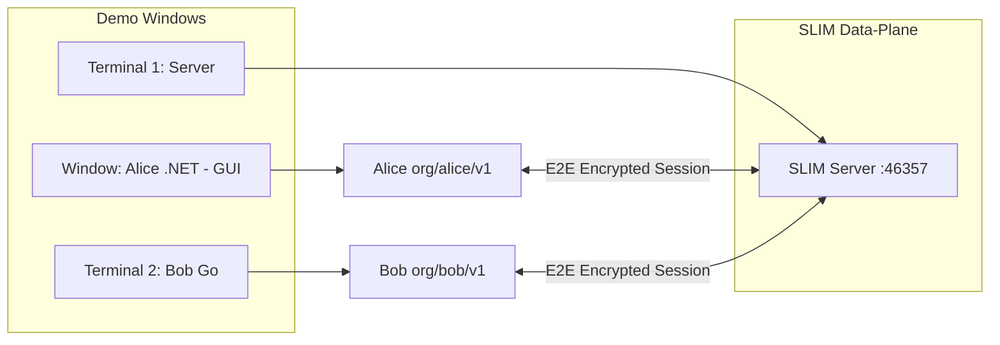
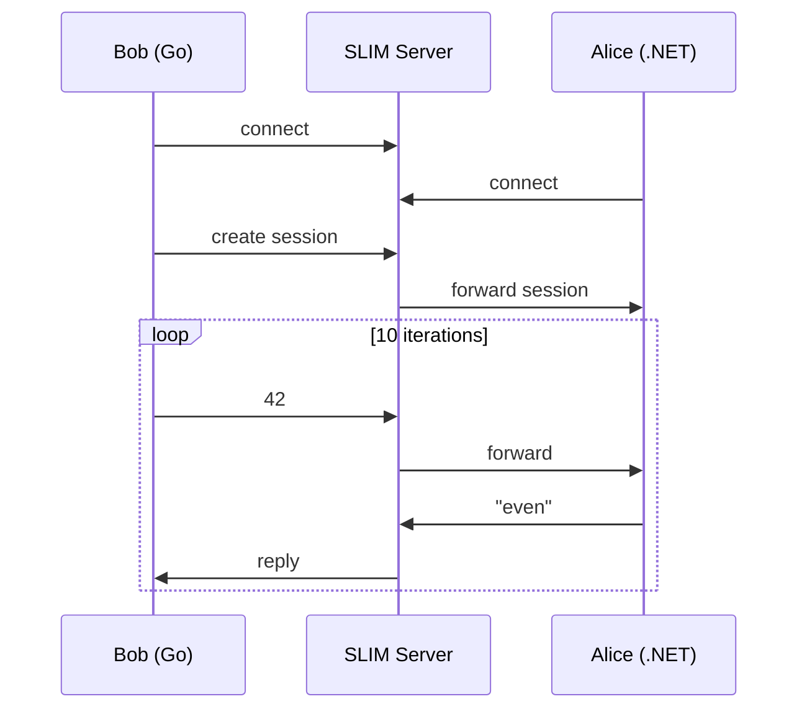
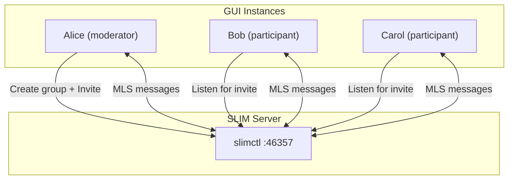

# SLIM .NET Demo

Two demos showcasing SLIM multi-language bindings:

1. **Point-to-Point (Odd/Even)** — Bob (Go) sends random numbers to Alice (.NET), who replies "odd" or "even".
2. **Group Chat (MLS)** — Multiple .NET GUI apps join an MLS-encrypted SLIM group to send and receive messages.

## Prerequisites

| Tool | Version | Notes |
|------|---------|-------|
| [Task](https://taskfile.dev/) | 3.x | Task runner |
| [.NET SDK](https://dotnet.microsoft.com/) | 8.0+ | For Alice |
| [Go](https://go.dev/) | 1.22+ | For Bob |
| C compiler | gcc/clang | Required by Go CGO |

No Rust build required — the server runs via a downloaded `slimctl` binary.

## One-Time Setup

```bash
git clone https://github.com/lgecse/slim-dotnet-demo.git
cd slim-dotnet-demo
task install
```

This will:
- Restore .NET NuGet packages (`Agntcy.Slim`)
- Download Go dependencies (`github.com/agntcy/slim-bindings-go`)
- Install SLIM native libraries for Go via `slim-bindings-setup`
- Download the `slimctl` binary (used to start the server without building the data-plane)

## Demo 1: Point-to-Point (Odd/Even)

Open **three separate terminals**, all from the repo root:

### Terminal 1 — SLIM Server

```bash
task server
```

Uses the downloaded `slimctl` binary to start the server. Wait until you see it listening on `localhost:46357`.

### Terminal 2 — Alice (.NET Receiver)

```bash
task alice
```

Alice connects and waits for incoming sessions. For each number she receives, she replies "odd" or "even".

### Terminal 3 — Bob (Go Sender)

```bash
task bob
```

Bob creates a session to Alice, sends 10 random numbers (1–100), and prints Alice's odd/even replies.

## Architecture



## What Happens



## Customizing

Pass custom flags via `CLI_ARGS`:

```bash
# Alice with a different server endpoint
task alice CLI_ARGS="--server http://localhost:9090"

# Bob with custom range and iterations
task bob CLI_ARGS="--min 1 --max 1000 --iterations 20"
```

### Alice flags

| Flag | Default | Description |
|------|---------|-------------|
| `--server` | `http://localhost:46357` | SLIM server endpoint |
| `--shared-secret` | `demo-shared-secret-min-32-chars!!` | Shared secret |

### Bob flags

| Flag | Default | Description |
|------|---------|-------------|
| `--remote` | `org/alice/v1` | Remote identity |
| `--iterations` | `10` | Number of numbers to send |
| `--min` | `1` | Minimum random number |
| `--max` | `100` | Maximum random number |
| `--server` | `http://localhost:46357` | SLIM server endpoint |
| `--shared-secret` | `demo-shared-secret-min-32-chars!!` | Shared secret |

---

## Demo 2: Group Chat (MLS Encrypted)

Multiple instances of the same .NET GUI app connect to a SLIM group with MLS encryption. One instance acts as the **moderator** (creates the group and invites others); the rest are **participants** (listen for invitations).

### Running the Group Demo

Open **three or more terminals** from the repo root.

#### Terminal 1 -- SLIM Server

```bash
task server
```

#### Terminal 2 -- Moderator (Alice)

```bash
task group:gui
```

In the GUI:
- **Identity**: `org/alice/v1`
- **Group**: `org/demo/group1`
- **Invite**: `org/bob/v1, org/carol/v1`
- Click **Connect**, then **Join Group**

#### Terminal 3 -- Participant (Bob)

```bash
task group:gui
```

In the GUI:
- **Identity**: `org/bob/v1`
- Leave **Invite** empty
- Click **Connect**, then **Join Group** (waits for invitation from moderator)

#### Terminal 4 -- Participant (Carol)

```bash
task group:gui
```

In the GUI:
- **Identity**: `org/carol/v1`
- Leave **Invite** empty
- Click **Connect**, then **Join Group**

### How It Works



- **Join**: The moderator creates the group session with `EnableMls = true` and invites listed participants. Participants call `ListenForSessionAsync()` and join when invited.
- **Send/Receive**: All participants publish and receive messages through the shared MLS-encrypted session.
- **Leave**: Click **Leave Group** to exit the session. The participants list updates for remaining members.
- **Participant visibility**: The GUI periodically refreshes the participant list via `GetParticipants()` and logs join/leave events (best effort).
